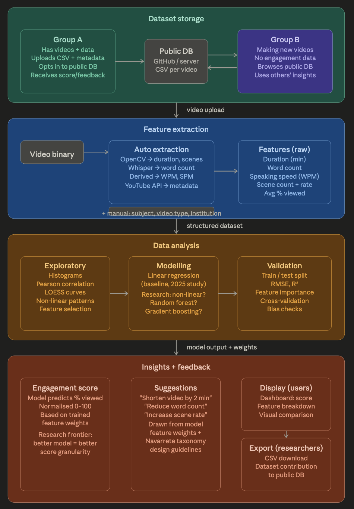

# Backend plan

## Model for the program

## Target Audience 
As per the client definition, there are two major groups of users (which have two types of sub-users). Group A are educators/researchers with existing video data who either:

        1. connect through their online cloud account (mainly targeting youtube for this scope) which contains videos
        2. or they upload videos from their local storage

The end goal for Group A is to receive feedback on the videos they have produced and potentially, with their consent, add to the public repository for others to reference.

Group B are prospective video makers who reference the community dataset without having any engagement data of their own.

Due to cost constraints and accessibility requirements for the project it would be best to host this on a Github platform where it can be accessed exit referenced by everyone without the need for creating an account. Furthermore, the lack of hosting means that the platform can grow with public interest and would not require active maintenance or development after the research team for this FYP is no longer working on the project.

